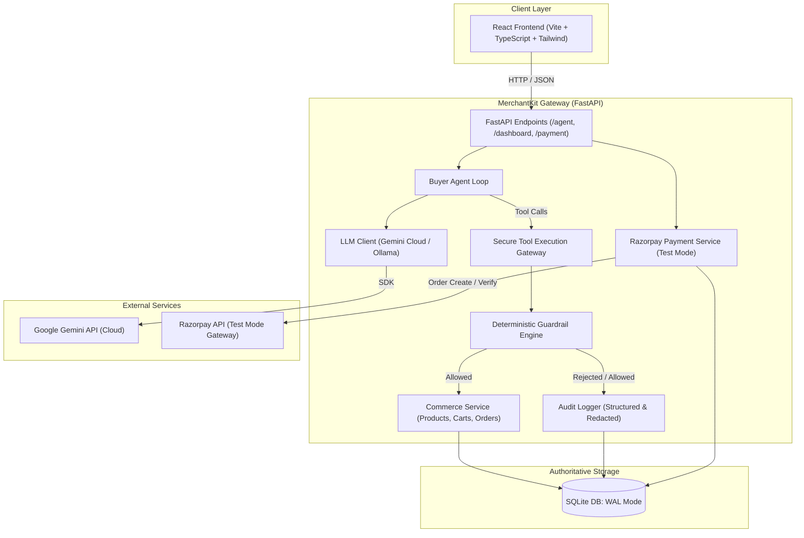

# MerchantKit

[](https://www.python.org/downloads/)
[](https://fastapi.tiangolo.com)
[](https://react.dev/)
[](https://vitejs.dev/)
[](https://razorpay.com/)
[](tests/)

> A secure, controlled AI commerce gateway enabling autonomous buyer agents to browse, cart, and order while enforcing strict deterministic guardrails and cryptographic payment boundaries.

---

## The Problem

As autonomous AI agents evolve from conversational assistants into economic actors, allowing them direct, unchecked access to merchant databases, inventory, and payment APIs introduces critical risks:
- **Price and Stock Hallucinations**: Models may invent arbitrary discounts, modify catalog prices, or order phantom stock.
- **Runaway Financial Exposure**: Unconstrained tool calling can lead to unbounded order quantities and astronomical purchase totals.
- **Unauthorized Transactions**: Agents executing autonomous payments without human approval or server-side cryptographic verification create catastrophic chargeback and security liabilities.
- **Lack of Traceability**: Unaudited agent loops make it impossible to diagnose why an action was taken or hold autonomous actors accountable.

---

## The Solution

**MerchantKit** is an authoritative, proxy-isolated **Agent Commerce Gateway**. Instead of granting LLMs direct database or payment access, MerchantKit treats the merchant system as a controlled set of tool APIs protected by deterministic guardrail policies:

1. **AI Proposes Actions**: The agent reasons and requests structured tool calls.
2. **Gateway Validates Schema**: Unknown tools, malformed arguments, and unauthorized payloads are intercepted immediately.
3. **Deterministic Guardrails Enforce Policy**: Server-side business rules (maximum cart value, item limits, allowed product categories) validate the operation independently of the model.
4. **Authoritative Execution**: The backend updates state only if guardrails pass; client-supplied prices or states are strictly ignored.
5. **Cryptographic Payment Boundary**: The AI cannot mark orders as `PAID`. Payment requires user initiation and server-verified Razorpay cryptographic signatures.
6. **Immutable Audit Trail**: Every request, decision (`ALLOWED` or `REJECTED`), argument, and outcome is permanently logged.

---

## Architecture



---

## Key Features

- **Autonomous AI Buyer Agent**: Natural language shopping goal resolution via function calling (product search, carting, order placement).
- **Hardened Tool Gateway**: Strict schema validation preventing command injection, path traversal, or unregistered tool execution.
- **Deterministic Server-Authoritative Guardrails**:
  - `MAX_ORDER_VALUE`: Hard ceiling (₹5,000.00 default) blocking runaway purchase amounts.
  - `MAX_QUANTITY_PER_ITEM`: Maximum unit limits (5 per item default) preventing hoarding.
  - `ALLOWED_CATEGORIES`: Whitelisted product categories (`mouse`, `keyboard`, `headset`).
  - `REQUIRE_PAYMENT_CONFIRMATION`: Requires explicit confirmation flag for checkout.
- **Razorpay Test Mode Integration**:
  - State machine: `NOT_CREATED` &rarr; `PENDING` &rarr; `PAYMENT_INITIATED` &rarr; `PAID` / `FAILED`.
  - Cryptographic HMAC-SHA256 signature verification on `/payment/verify`.
  - Air-gapped: AI models have no access to payment completion tools.
- **Real-Time Observability**:
  - Full React Dashboard featuring Overview, AI Buyer, Commerce Inspector, Guardrail Visualizer, Payments Portal, and Audit Trail.
  - Redaction of sensitive fields (`api_key`, `secret`, `password`) in logs.

---

## Security Model

| Boundary | Policy Enforcement |
| :--- | :--- |
| **Model Isolation** | AI proposes tool calls; never directly connects to SQLite or payment APIs. |
| **Pricing Authority** | Prices and totals are computed exclusively from database records; model claims are ignored. |
| **Guardrails** | Non-bypassable server-side validation executed before any database commit. |
| **Payment Security** | `RAZORPAY_KEY_SECRET` never leaves the backend. Orders are only marked `PAID` via verified cryptographic signatures. |
| **Secret Redaction** | All API keys and secrets are automatically masked before persisting to the audit log. |

---

## Project Structure

```text
MerchantKit/
├── app/                        # FastAPI Backend Application
│   ├── agent.py                # AI Buyer Agent conversation loop
│   ├── audit.py                # Structured audit logger with secret redaction
│   ├── cart.py                 # Cart operations and lifecycle management
│   ├── catalog.py              # Product search and inventory catalog
│   ├── config.py               # Pydantic application settings
│   ├── database.py             # SQLite WAL-mode connection and schemas
│   ├── executor.py             # Safe tool execution dispatcher
│   ├── guardrails.py           # Deterministic policy validation engine
│   ├── llm.py                  # Multi-provider LLM interface (Gemini / Ollama)
│   ├── main.py                 # FastAPI routes and middleware configuration
│   ├── order.py                # Order creation and state transitions
│   ├── payment.py              # Razorpay service and HMAC signature verification
│   ├── schemas.py              # Pydantic models for API and tools
│   ├── tool_interface.py       # Function calling schema translation
│   └── tools.py                # Registered tool definitions
├── data/                       # Catalog CSVs and SQLite database
│   ├── products.csv            # Sample electronics catalog
│   └── sample_catalogs/        # Backup and domain catalog presets
├── frontend/                   # React 19 + Vite Dashboard
│   ├── src/
│   │   ├── api/                # Typed API client for FastAPI backend
│   │   ├── components/         # StatusBadge, Timeline, PageHeader, EmptyState
│   │   ├── layouts/            # Navigation bar and shell layout
│   │   └── pages/              # Overview, AiBuyer, Commerce, Guardrails, Payments, AuditTrail
│   ├── package.json
│   └── vite.config.ts          # Vite configuration with API reverse proxy
├── tests/                      # Automated Test Suite (326 tests)
│   ├── test_agent.py
│   ├── test_audit.py
│   ├── test_guardrails.py
│   ├── test_gemini_provider.py
│   ├── test_payment.py
│   └── ...
├── .env.example                # Template for environment configuration
├── .gitignore                  # Git ignore rules for secrets, build artifacts, etc.
├── DEMO.md                     # Step-by-step Razorpay AI Buildathon walkthrough
├── diagnose_llm.py             # Diagnostic utility for LLM connectivity
├── requirements.txt            # Python dependencies
├── run.py                      # Uvicorn backend launcher
└── seed_db.py                  # Catalog database initialization script
```

---

## API Reference

| Method | Endpoint | Description |
| :--- | :--- | :--- |
| `POST` | `/agent/chat` | Multi-turn AI shopping agent with tool execution |
| `POST` | `/payment/initiate` | Generates or fetches Razorpay order ID and checkout params |
| `POST` | `/payment/verify` | Verifies Razorpay HMAC-SHA256 signature and marks order `PAID` |
| `GET` | `/dashboard/overview` | Aggregated statistics, order counters, and recent activity |
| `GET` | `/dashboard/commerce` | Lists active products, carts, and finalized orders |
| `GET` | `/dashboard/guardrails`| Active policy limits and recent guardrail decisions |
| `GET` | `/dashboard/audit` | Filterable, immutable audit trail of all actions |
| `GET` | `/health` | System health check |
| `GET` | `/health/llm` | Live LLM provider connectivity status |

---

## Setup & Installation

### 1. Prerequisites
- **Python 3.11+**
- **Node.js 18+** & `npm`
- *(Optional)* [Google AI Studio Gemini API Key](https://aistudio.google.com/) for cloud LLM.
- *(Optional)* [Razorpay Test Mode Account](https://dashboard.razorpay.com/) for live payment checkout.

### 2. Backend Setup
```bash
# Clone the repository
git clone https://github.com/PravarKhandelwal16/MerchantKit.git
cd MerchantKit

# Create and activate virtual environment
python -m venv .venv
# Windows (PowerShell):
.venv\Scripts\Activate.ps1
# Linux / macOS:
source .venv/bin/activate

# Install dependencies
pip install -r requirements.txt

# Configure environment
copy .env.example .env

# Seed sample product catalog
python seed_db.py
```

### 3. Frontend Setup
```bash
cd frontend
npm install
cd ..
```

---

## Environment Variables

Configure `.env` using the provided `.env.example` template:

```env
# Application & Database
APP_NAME="Merchant-as-a-Tool Agent Gateway"
DATABASE_URL="sqlite:///./data/gateway.db"

# Active LLM Provider: "gemini" (cloud default) or "ollama" (local fallback)
LLM_PROVIDER=gemini

# Google Gemini Cloud LLM Configuration (Primary)
GEMINI_API_KEY="your_gemini_api_key_here"
GEMINI_MODEL="gemini-3.5-flash-lite"

# Ollama Configuration (Optional Local Fallback)
OLLAMA_BASE_URL="http://localhost:11434"
OLLAMA_MODEL="qwen3:8b"

# Razorpay Test Mode Credentials (For Payments Page)
RAZORPAY_KEY_ID="rzp_test_your_key_id"
RAZORPAY_KEY_SECRET="your_test_key_secret"
```

---

## Running the Project

### Start the Backend (FastAPI)
```bash
# From repository root:
uvicorn app.main:app --host 127.0.0.1 --port 8000 --reload
# Or simply:
python run.py
```
- API Docs: `http://localhost:8000/docs`
- Health Check: `http://localhost:8000/health`
- LLM Health: `http://localhost:8000/health/llm`

### Start the Frontend (React + Vite)
```bash
# In a second terminal:
cd frontend
npm run dev
```
- Dashboard UI: `http://localhost:5173/`

---

## Testing & Validation

All automated tests use mocks and do not require external network requests or active API keys.

```bash
# Run complete Python test suite (326+ tests)
python -m pytest -v

# Validate frontend production build & TypeScript types
cd frontend
npm run build
```

---

## Demo Flow

For a structured Razorpay AI Buildathon walkthrough, see [DEMO.md](DEMO.md).
